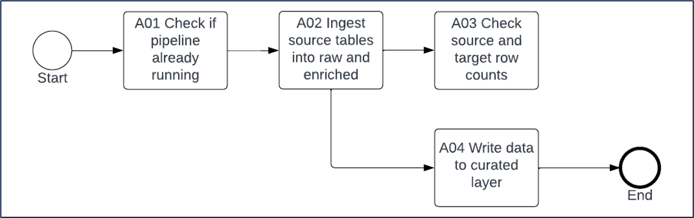

# ANS CoE Strategic Data Lakehouse
# Low Level Design (LLD)

[[_TOC_]]

# Author(s)
Tom Legge

# Framework Overview

This document describes a data lakehouse framework, known as the Strategic Data Lakehouse (SDLH) built on top of Azure Synapse. The solution is the ANS Data Centre of Excellence adaptation of the data lakehouse paradigm.[\[1\]](#endnote-1)

The lakehouse approach combines the functionality of a data warehouse with the flexibility of a data lake.

The SDLH components have been broken down into 10 conceptual parts.

1. **The metadata database**: a lightweight SQL database that supports the data platform by providing the following functionality:
    1. Stores metadata about source systems, such as database names, source system type, table names, column names, data types.
    2. Stores metadata that is used by data ingestion pipelines, such as load type (incremental or full), last updated dates etc.
    3. Holds stored procedures which are executed by pipelines during ETL processes, such as for creating new log entries or for updating the last updated date for a given table, when incremental loading is used.
    4. Stores the output from the ‘Logging Module’ in a logging table, which provides a record of each Synapse pipeline run.
2. **Azure Storage**: supports the data platform through the following services:
    1. **Azure Data Lake Gen2:** used for persisting data that has been ingested into the platform.
    2. **Azure Storage Queue:** used by ELT processes to queue the objects (typically tables) to be ingested.
3. **Conceptual data layers\***: raw, staging, serving and curated layers. Data moves through these layers during data ingestion ELTs. All layers make use of the data lake for persistence, with parquet being the default file type.
    1. **Raw**: source system data is stored as parquet files in the raw layer
    2. **Enriched**: data is merged into deltalake delta tables and external tables created so that the delta tables can be access via the serverless SQL endpoints.
    3. **Curated**: new table or views are created in 1 or more transformation steps with the end goal to create consumable data models.
4. **Synapse Pipelines**: orchestrate the ETL activities
5. **Synapse Spark** **Notebooks**: contain code that is used during different ETL stages, such as merge new data into the staging layer.
6. **Logging**: is used to log a history of pipeline runs, on a per object basis (i.e. table) in the metadata database. Provides easy to understand information about the object that was ingestion and a record of the number of inserts, updates and deletes.
7. **Delta lake**: used in the staging layer as an ACID compliant database[\[2\]](#endnote-2)
8. **Serverless SQL pool:** used in the serving and curated layer, to make data easily available to end users and tool such as PowerBI.[\[3\]](#endnote-3)
9. **Azure Key Vault:** is used to secure store credentials, such as connection strings to source systems
10. **Self-hosted Integration Runtime** (SHIR): Compute infrastructure required to connect to and integrate data sources hosted on-prem and on third-party cloud providers.

# High Level Architecture

The following diagram describes how data flows from source systems into the SDLH. All ELTs are orchestrated by Azure Synapse. All business data is stored in an Azure Data Lake, with containers for each data layer. Metadata about the source systems and logging data is stored in the metadata database, which is an Azure SQL database.

Container names and serverless database names are customisable, as are the number of ‘serving’ and curation’ layers. For example, a set of medallion layers can be configured at the storage account container level and the database and schema level.

# SDLH Capabilities

| Area | Function | Notes |
| --- | --- | --- |
| Metadata | Base Metadata | Metadata is seeded through a simple csv file stored initial in the DevOps Repo. |
| Curated Metadata | Metadata to drive the curation layers is stored and maintained initially in a DevOps report. |
| Automated metadata deployment | Base metadata and curation metadata forms are deployed across environments through automated CI/CD pipelines. |
| Automated metadata generation | Creation of ‘full’ metadata is automated through Synapse pipelines which extract it from source systems. |
| Custom metadata columns | For flexibility, a set of custom columns are included in the base metadata and the curation metadata forms. |
| Automated schema updating | For supported source systems, changes in the source system schema can be automatically updated in the data platform. |
| Ingestion | Types:  Full loads  Incremental loads using:  Change Tracking  Change Data Capture  Watermark values (dates and rowversions) | Various loading strategies are supported |
| Supported Source Systems:  Azure SQL  Azure SQL Managed Instance  SQL Server  MySQL  PostgreSQL  Oracle  Salesforce  HTTPs (API)  OData  Reference Data (as csvs)  Excel  Progress OpenEdge | All source systems with ready-made SDLH compliant pipelines. |
| Curation | SQL CETAS | Creation logic entirely encapsulated within the curation metadata form. Good for simple transformations. |
| SQL Stored Procedures | Typically for creating external tables – highly flexible and performant. Fully source controlled and deployable through the DevOps pipelines. Executed via Synapse using the curation metadata. |
| SQL Table Valued Functions | Fully source controlled and deployable through CI/CD |
| SQL Views | Fully source controlled and deployable through CI/CD |
| Notebooks | Not part of the SDLH framework, but an option for users wanting to use spark in their curation layer |
| Mapping Data Flows | Not part of the SDLH framework, but an option for users wanting to use spark in their curation layer |
| Consumption | Serverless Pools | Automatically create databases during ETL based on metadata  Automatically create a series of serverless databases through Synapse pipelines, which handle external data sources and external file types. |
| Storage Accounts | Automatically creates relevant containers during ETLs based on metadata |
|     |     |     |

# Metadata Database Components and Processes Breakdown

## Metadata Form

Metadata starts life as a csv file named ‘metadata_form.csv’ and is stored in the DevOps repo. Changes to this form are deployed to the relevant Azure storage accounts using a DevOps pipeline.

The metadata_form.csv file is loaded into the Azure SQL metadata database in each environment, this is the typical starting point for metadata before Synapse pipelines are run to fully populate the additional metadata database tables.

## Metadata Database

The following tables exist in the Azure SQL metadata database:

| Table Name | Function |
| --- | --- |
| \[ETL\].\[BaseMetadata\] | Replicates the values in the metadata_form.csv file. |
| \[ETL\].\[LogRowCounts\] | Used to stored results when running the synapse ‘row counts’ pipeline. |
| \[ETL\].\[SQLColumnMetadata\] | Captures metadata about columns, such as data type, length, nullable. Populated by Synapse pipelines for generating more completed metadata for SQL source systems. |
| \[ETL\].\[JsonMetadata\] | A metadata table used to stored a json object for each source system table, consumed by various activities within ETL pipelines. |
| \[ETL\].\[Log\] | Used to store log entries generated by Synapse ETL and metadata pipelines. |
| \[ETL\].\[SQLTableMetadata\] | Populated by the various ‘generate metadata’ pipelines, after the pipelines query the INFORMATION_SCHEMA.Tables (or equivalent) tables in the source systems. |
| \[ETL\].\[CurationMetadata\] | Replicates the values in the curation_metadata_form.csv file. |
| \[ETL\].\[GenericColumnMetadata\] | Used to store column level metadata, for non-SQL source systems. |
| \[ETL\].\[GenericTableMetadata\] | Used to stored table or ‘object’ level metadata for non-SQL source systems. |
|     |     |

## Populating the Metadata Database

The following Synapse pipeline is illustrative of the typical ‘generate metadata’ pipelines when the source is a type of SQL database.

Steps

1. Runs a query on Metadata DB to retrieve required items for supplied SOURCE_TYPE & SOURCE_SYSTEM.
2. Retrieves latest Table Column config from the source systems INFORMATION_SCHEMA to be used within the loop.
3. Retrieves current Table Column config from the Metadata DB be used within the loop to compare with new Table Column config. (MAX is used as a workaround for first load when there is no current config. It returns as NULL instead of nothing).
4. For the list of tables, upserts into ETL.SQLTableMetadata.
5. This activity is a lookup which runs a stored procedure which generates a log entry in the ETL.Log table.
6. This step is required to disable any columns that have been deleted from the source system since last run. It is a stored procedure in the metadata database. It automatically sets all ‘IS_ENABLED’ values to 0 in the columns metadata table for the table in the loop.
7. Writes required config to ETL.SQLColumnMetadata using an upsert. Re-enables any columns that still exist in the source system metadata.
8. Populates the column ETL.SQLTableMetadata.CHANGE_TRACKING_JOIN_CONDITION if the load type need to use ‘SQL Server Change Tracking’.
9. This activity is a lookup which runs a stored procedure which generates a log entry in the ETL.Log table.
10. Executes a stored procedure which completes any update to the SCHEMA_VERSION column in the table ETL.SQLTableMetadata, incrementing the version number by 1 if there has been a change. The stored procedure itself identifies if there has been a change in the information schema using this condition: ‘AND \[INFORMATION_SCHEMA\] != @PARAM_CHECK_INFORMATION_SCHEMA’.
11. Executes a stored procedure which checks if any updates are required to table ETL.JsonMetadata.

# Data Ingestion, Preparation and Serving Process Flow

## Control Pipeline

A typical ETL pipeline orchestrates the end-to-end ingestion and curation of data. This is achieved by invoking other pipelines through the a control pipeline. There are many patterns that can be used. The simplest control pipeline may consist of the following activities:

Steps

A01

To ensure the same pipeline (based on the pipeline name) isn’t already running, this check is first performed. This is useful when incremental loads are closely spaced and there is a risk that an earlier pipeline run could still be running by the time the next scheduled run is triggered.

A02

The first activity is typically to ingest from the source system, by invoking one of the existing SDLH pipelines (such as the “sdlh_sql_load”) and configuring the required pipeline parameters (e.g. source system name). This will ensure the pipeline uses the correct metadata.

A03

An optional step, which is typically deactivated in production, but useful for validating pipelines are performing as expected. Writes results to the metadata database.

A04

One or more individual activities, driven by the curation metadata and either creating views, executing stored procedures or executing CETAs logic directly from the curation metadata form.

## Typical ETL Load Pipeline

The following diagrams are illustrative of the pattern used in loading data into the platform. Each source system type (e.g. Azure SQL, postgreSQL etc.) will have its own characteristics which necessitate variation between pipeline designs. This pattern uses the SQL Server load pipeline and its various child pipelines as an example.

### Parent Load Pipeline

This pipeline would be invoked in step A02 in the ‘control pipeline’ diagram above. This pipeline itself invokes various child pipelines, described below.

Steps

Part 1

1. On serverless metadata database: Execute the stored procedure Config.usp_GetPipelineParameters to return the pipeline parameters. The provides the Synapse pipeline information such as the workspace name, subscription id etc. The parameters are stored in a json file in the underlying storage account.
2. Checks if the ‘last pipeline run check’ parameter is set to true or false
3. Runs a stored procedure in the metadata database to determine the status of the last pipeline run (by querying the ETL.Log table). This stored procedure is run from within SDLH ingestion pipelines in Azure Synapse Analytics. It takes in 3 parameters extracted from Synapse using pipeline dynamic expressions.
4. Attempts to re-use the previous storage queue from the failed pipeline run.
5. If previous pipeline run has succeeded, a new storage queue is created.
6. New log entry in the ETL.Log table is created for the pipeline run.

Part 2

1. Runs a query on Metadata DB to retrieve required items for supplied SOURCE_SYSTEM & PARAM_SOURCE_GROUPING_ID. Its returns any enabled Tables where LOAD_TYPE is FULL_LOAD or CHANGE_TRACKING where LAST_CHANGE_TRACKING_VALUE IS NULL
2. Invokes the full load pipeline
3. Update ETL.Log if invoked pipeline fails and halt current pipeline
4. Runs a query on Metadata DB to retrieve required items for supplied SOURCE_SYSTEM & PARAM_SOURCE_GROUPING_ID. Its returns any enabled Tables where LOAD_TYPE is WATERMARK. ( If LAST_WATERMARK_VALUE IS NULL it uses datetime value of '1900-01-01 00:00:00' to simulate a first run scenario )
5. Invokes the high watermark pipeline
6. Update ETL.Log if invoked pipeline fails and halt current pipeline
7. Runs a query on Metadata DB to retrieve required items for supplied SOURCE_SYSTEM & PARAM_SOURCE_GROUPING_ID. Its returns any enabled Tables where LOAD_TYPE is CHANGE_TRACKING and LAST_CHANGE_TRACKING_VALUE IS NOT NULL
8. Runs the change tracking pipeline
9. Update ETL.Log if invoked pipeline fails and halt current pipeline

Part 3

1. Invokes the enriched layer spark notebook, which creates or updates delta tables in the enriched / bronze layer (based on the naming of the layers selected by customer).
2. Invoke the change tracking updates pipeline, which updating the metadata database with the updated change tracking version number following merge of changes into the enriched / bronze layer.
3. If failure on update change tracking pipeline, write error message to ETL.Log and halt current pipeline.
4. Invoke ‘update watermark’ pipeline to update the metadata database with the new high watermark value for each table incrementally loaded.
5. If invoked pipeline fails, then update ETL.Log with failure and halt current pipeline.
6. If enriched layer notebook fails, writes error to ETL.Log and halts current pipeline.
7. Update ETL.Log once all previous steps completed successfully.
8. Delete storage queue.

Steps above, invoke further child pipelines, as described.

### Full Load pipeline

This child pipeline handles full initial loads when the loading strategy is full loads every time and when Change Tracking will be used to identify incremental loads.

Steps

1. Runs a query on Metadata DB to retrieve required items for supplied SOURCE_SYSTEM & PARAM_SOURCE_GROUPING_ID. Its returns any enabled Tables where LOAD_TYPE is FULL_LOAD or CHANGE_TRACKING where LAST_CHANGE_TRACKING_VALUE IS NULL.
2. This lookup executes a stored procedure which returns object data from ETL.JsonMetadata from a supplied OBJECT_NAME.
3. This lookup runs a stored procedure which generates a log entry in the ETL.Log table.
4. Copy activity that takes SQL server tables and writes them as Parquet in the RAW hierarchical namespace within ADLS.
5. Update ETL.Log on success.
6. Post table name to storage queue.
7. Update ETL.Log on failure.
8. This lookup queries the change tracking tables to get the current highest change tracking value.
9. This lookup runs a stored procedure which generates a log entry in the ETL.Log table.
10. Copy activity that takes SQL server tables and writes them as Parquet in the RAW hierarchical namespace within ADLS.
11. Executes a stored procedure to update on success.
12. Posts table name to storage queue.
13. Executes a stored procedure to update on failure.

### Watermark Pipeline

This child pipeline handles watermark loads – but the full initial load and subsequent incremental loads.

Steps

1. Runs a query on Metadata DB to retrieve required items for supplied SOURCE_SYSTEM & PARAM_SOURCE_GROUPING_ID. Its returns any enabled Tables where LOAD_TYPE is WATERMARK. ( If LAST_WATERMARK_VALUE IS NULL it uses datetime value of '1900-01-01 00:00:00' to simulate a first run scenario ).
2. This lookup executes a stored procedure which returns object data from ETL.JsonMetadata from a supplied OBJECT_NAME.
3. Running a query against the table in the source system, to get the newest watermark datetime in the table.
4. This lookup runs a stored procedure which generates a log entry in the ETL.Log table.
5. This lookup runs a stored procedure which generates a log entry in the ETL.Log table.
6. Copy activity that takes SQL server tables and writes them as Parquet in the RAW hierarchical namespace within ADLS.
7. Executes a stored procedure to update on failure.
8. Executes a stored procedure to update on success
9. POST the table name into the Azure Storage Queue.

### Change Tracking Pipeline

This pipeline handles incremental loads when SQL Sever Change Tracking is used as a method of recording changes to records at the database level.[\[4\]](#footnote-1)

Steps

1. Runs a query on Metadata DB to retrieve required items for supplied SOURCE_SYSTEM & PARAM_SOURCE_GROUPING_ID. Its returns any enabled Tables where LOAD_TYPE is CHANGE_TRACKING and LAST_CHANGE_TRACKING_VALUE IS NOT NULL
2. Runs a query on the source system database that brings back a list of tables which have new records since the last pipeline run (based on the ‘LAST_CHANGE_TRACKING_VALUE’ stored for each table in the metadata database).[\[5\]](#footnote-2)
3. Filter out tables where no new changes detected
4. This lookup executes a stored procedure which returns object data from ETL.JsonMetadata from a supplied OBJECT_NAME
5. Get the table primary key from the ‘OBJECT_PARAMETERS’ json object inside ETL.JsonMetadata table.
6. Creates a join condition for the table name, used in part of the dynamic query in the subsequent activity to generate log data for ETL.Log.
7. Get the previously stored change tracking version from \[ETL\].\[SQLTableMetadata\], which will be used as part of the query in the subsequent copy activity
8. This lookup runs a stored procedure which generates a log entry in the ETL.Log table.
9. Incrementally copies new records along with change tracking information (such as ‘operation’) into the raw container in the data lake.
10. Update ETL.Log if prior step has failed.
11. Lookup counts for INSERTS or UPDATES for ETL.Log.
12. Update ETL.Log if prior activity has succeeded.
13. Post the table name to the storage queue.

### Raw to Enriched Pipeline

This pipeline uses spark notebooks to process raw data. It loads the data into delta tables and merges any new records when possible. It also creates external tables, to make the tables visible to the Synapse serverless pool.

Steps

1. Get the list of tables from the Azure Storage Queue to process, based on what objects have been ingested in the source -> raw step.
2. Write to dataframes called ‘df_columns’ and ‘df_meta’.
3. Extract metadata from dataframes.
4. Using metadata, identify the correct raw file path for the given object and read the file into a dataframe.
5. For each object, overwrite the delta table based on the latest copy of the full load.
6. Update the delta tables by either updating, or inserting records.
7. The dataframe is split into 2 - one with all records to be deleted and one with all records to be updated or inserted.
8. Update the delta tables by either updating, or inserting records.
9. Rows deleted from delta table.
10. If updating the delta table fails, then write error message to log and halt ETL.
11. If updates to delta table succeed, then create log entry and record number of inserts, updates and deletes.
12. Remove the object name from the queue so that it isn’t processed again in this pipeline run.
13. Create Database, Schema, Encryption Key, External Data Source, External File Format.
14. This contains all the information required to create the external table.
15. Create (if it doesn’t already exist) the External Tables for the Serverless SQL pool.

### Change Tracking Update Pipeline

When the raw to enriched pipeline has succeeded, this pipeline is triggered to update the change tracking values in the metadata database (if required).

Steps

1. Runs a query on Metadata DB to retrieve required items for supplied SOURCE_SYSTEM & PARAM_SOURCE_GROUPING_ID.
2. Lookup the new change tracking value from ETL.Log
3. Execute stored procedure to update the change tracking of each required table.
4. This lookup runs a stored procedure which generates a log entry in the ETL.Log table.
5. This lookup runs a stored procedure which generates a log entry in the ETL.Log table.

### High Watermark Update Pipeline

When the raw to enriched pipeline has succeeded, this pipeline is triggered to update the watermark values in the metadata database (if required).

Steps

1. Lookup tables requiring an update to the watermark values
2. Lookup the new watermark value from ETL.Log
3. Execute stored procedure to update the watermark of each required table,
4. This lookup runs a stored procedure which generates a log entry in the ETL.Log table.
5. This lookup runs a stored procedure which generates a log entry in the ETL.Log table.

# Curation Metadata and Pipelines

## High Level Design

Curation when it is metadata driven, starts with the curation metadata form, which is then pushed into the relevant storage accounts via a devops pipeline and is then loaded into the curation metadata table in the metadata database.

The 4 different metadata driven curation pipelines below all use the curation metadata table to get parameters and in some cases sql logic to pass into stored procedures which create the curated layer datas, either through external tables or views.

## Curation Pipelines

### Creating a table using a Stored procedures (using CETAS)

Steps

1. Queries the table ETL.CurationMetadata, filtering by grouping id and priority
2. Deletes files from the storage account
3. Runs a stored procedure, which executes the stored procedure referenced in the CurationMetadata table.

### Creating a table using a query (using CETAS)

Steps

1. Queries the table ETL.CurationMetadata, filtering by grouping id and priority
2. Deletes files from the storage account
3. Runs a stored procedure, which takes the query logic from the CurationMetadata table and wraps inside a CETAS statement.

### Creating a view from a csv file via OPENROWSET

Steps

1. Queries the table ETL.CurationMetadata, filtering by grouping id and priority
2. Runs a stored procedure, which wraps sql logic stored in the curation metadata table inside a ‘CREATE OR MODIFY VIEW.. FROM OPENROWSET’ statement, in order to build a view on top of a csv file already in the storage account.

### Creating a view from existing external tables or views

Steps

1. Queries the table ETL.CurationMetadata, filtering by grouping id and priority
2. Runs a stored procedure, which wraps sql logic stored in the curation metadata table inside a ‘CREATE OR MODIFY VIEW’ statement, in order to build a view on top of tables or views that already exist in the serverless layer.

# Roles, Permissions and Security

## High Level Overview of Roles

List of Objects and their Roles

During development phase, the following roles are used. Security Group naming may vary based on customer-specific naming rules.

| **AAD Group Name** | **RBAC Role** | **Application** | **Description** |
| --- | --- | --- | --- |
| aad_grp_data_prod_synapse_administrator | Synapse Administrator | Synapse Workspace | Full synapse access |
| aad_grp_data_prod_purview_collection_admins | Purview Administrator | MS Purview | Assign roles to other users in the Microsoft Purview governance portal or manage collections |
| aad_grp_data_prod_sql_administrator | SQL Administrator | SQL Database | Full access to any SQL databases |
| aad_grp_data_prod_resource_group_contributor | Contributor | Azure IAM | Grants full access to manage all data resources, but does not allow user to assign roles in Azure RBAC |
| aad_grp_data_prod_resource_group_reader | Reader | Azure IAM | View all data resources, but does not allow user to make any changes |
| aad_grp_data_prod_keyvault_secrets_officer | Key Vault Secrets Officer | Azure IAM | Perform any action on the secrets of a key vault, except manage permissions |
| aad_grp_data_prod_keyvault_secrets_user | Key Vault Secrets User | Azure IAM | Can read key vault secret contents |
| aad_grp_data_prod_datalake_blob_contributor | Storage Blob Data Contributor | Azure IAM | Allows for read, write and delete access to Azure Storage blob containers and data |
| aad_grp_data_prod_datalake_blob_reader | Storage Blob Data Reader | Azure IAM | Allows for read access to Azure Storage blob containers and data |
| aad_grp_data_prod_synapse_contributor | Synapse Contributor | Synapse Workspace | Full Synapse access to Apache Spark pools and Integration runtimes. Includes create, read, update, and delete access to all published code artifacts and their outputs, including credentials and linked services |
| aad_grp_data_prod_synapse_user | Synapse User | Synapse Workspace | List and view details of SQL pools, Apache Spark pools, Integration runtimes and published linked services |
| aad_grp_data_prod_synapse_spark_administrator | Synapse Spark Administrator | Synapse Workspace | Full Synapse access to Apache Spark Pools |
| aad_grp_data_prod_sql_dbowner | dbowner | SQL Database | Can perform all configuration and maintenance activities on the database, and can also drop the database in SQL Server |
| aad_grp_data_prod_sql_dbddladmin | dbddladmin | SQL Database | Can run any Data Definition Language (DDL) command in a database |
| aad_grp_data_prod_sql_dbdatawriter | dbdatawriter | SQL Database | Can add, delete, or change data in all user tables |
| aad_grp_data_prod_sql_dbdatareader | dbdatareader | SQL Database | Can read all data from all user tables and views |
| aad_grp_data_prod_purview_data_curators | Purview Curator | MS Purview | Provides access to the data catalog to manage assets, configure custom classifications, set up glossary terms, and view data estate insights. Data curators can create, read, modify, move, and delete assets. |
| aad_grp_data_prod_purview_data_readers | Purview Reader | MS Purview | Provides read-only access to data assets, classifications, classification rules, collections, and glossary terms |

Typical ANS Engineers security group memberships

Can be used by customers as a template for their own custom security groups

| **AAD Group Name** | **RBAC Role** | **Application** | **Description** |
| --- | --- | --- | --- |
| aad_grp_data_ans_engineers | Role for ANS Engineers | Modern Data Platform | For ANS to provide effective delivery and ongoing support an overarching Azure AD group will be created for ANS Engineers to be added to. The group will then be a member of the Azure AD group's below to provide access to all 3 deployed environments. |

| **AAD Group Membership** | **RBAC Role** | **Application** | **Description** |
| --- | --- | --- | --- |
| aad_grp_data_dev_resource_group_contributor | Contributor | Azure IAM | Grants full access to manage all data resources, but does not allow user to assign roles in Azure RBAC |
| aad_grp_data_dev_synapse_administrator | Synapse Administrator | Synapse Workspace | Full synapse access |
| aad_grp_data_dev_sql_administrator | SQL Administrator | SQL Database | Full access to any SQL databases |
| aad_grp_data_dev_keyvault_secrets_officer | Key Vault Secrets Officer | Azure IAM | Perform any action on the secrets of a key vault, except manage permissions |
| aad_grp_data_dev_datalake_blob_contributor | Storage Blob Data Contributor | Azure IAM | Allows for read, write and delete access to Azure Storage blob containers and data |
|     |     |     |     |
| aad_grp_data_test_resource_group_contributor | Contributor | Azure IAM | Grants full access to manage all data resources, but does not allow user to assign roles in Azure RBAC |
| aad_grp_data_test_synapse_administrator | Synapse Administrator | Synapse Workspace | Full synapse access |
| aad_grp_data_test_sql_administrator | SQL Administrator | SQL Database | Full access to any SQL databases |
| aad_grp_data_test_keyvault_secrets_officer | Key Vault Secrets Officer | Azure IAM | Perform any action on the secrets of a key vault, except manage permissions |
| aad_grp_data_test_datalake_blob_contributor | Storage Blob Data Contributor | Azure IAM | Allows for read, write and delete access to Azure Storage blob containers and data |
|     |     |     |     |
| aad_grp_data_prod_resource_group_contributor | Contributor | Azure IAM | Grants full access to manage all data resources, but does not allow user to assign roles in Azure RBAC |
| aad_grp_data_prod_synapse_administrator | Synapse Administrator | Synapse Workspace | Full synapse access |
| aad_grp_data_prod_sql_administrator | SQL Administrator | SQL Database | Full access to any SQL databases |
| aad_grp_data_prod_keyvault_secrets_officer | Key Vault Secrets Officer | Azure IAM | Perform any action on the secrets of a key vault, except manage permissions |
| aad_grp_data_prod_datalake_blob_contributor | Storage Blob Data Contributor | Azure IAM | Allows for read, write and delete access to Azure Storage blob containers and data |

## Recommended Roles

These roles cover typical use cases. For a detailed understanding of roles within Synapse please see the Microsoft docs.[\[6\]](#footnote-3) A key point is that access to SQL pools is managed using SQL permissions. With the exception of the Synapse Administrator and Synapse SQL Administrator roles, Synapse RBAC roles do not grant access to SQL pools. Database authentication for both Serverless SQL databases in Synapse and the Azure SQL metadata database can be through SQL authentication or AAD authentication – we recommend AAD authentication.[\[7\]](#footnote-4)

<table><tbody><tr><th>
Persona
</th><th>
Typical Tasks
</th><th>
Resource
</th><th>
Roles
</th><th>
Justification
</th><th>
Scope
</th></tr><tr><td rowspan="2">
Synapse Administrator
</td><td rowspan="2"><ul><li>Assign roles to other users</li><li>Manage platform</li></ul></td><td>
Synapse
</td><td>
Synapse Administrator
</td><td>
Administration of platform
</td><td>
Dev, Test, Prod
</td></tr><tr><td>
KeyVault
</td><td>
KeyVault Secrets: set, list, get<a href="#footnote-5" id="footnote-ref-5">[8]</a>
</td><td>
To manage KeyVault secrets
</td><td>
Dev, Test, Prod
</td></tr><tr><td rowspan="5">
Data Engineer
</td><td rowspan="5"><ul><li>Updating metadata</li><li>Modifying and creating Synapse Pipelines, Linked Services, Integration Datasets</li><li>Turning Triggers on and off</li><li>Creating and modifying Spark clusters</li><li>Promoting changes to test and prod environments</li><li>Creating new Serverless SQL schema</li></ul></td><td>
Synapse
</td><td>
Synapse Administrator
</td><td>
Needed for engineering tasks
</td><td>
Dev, Test, Prod
</td></tr><tr><td>
Storage Account (data)
</td><td>
Storage Blob Data Contributor
</td><td>
To edit data (e.g. config files)
</td><td>
Dev, Test, Prod
</td></tr><tr><td>
Storage Account (data)
</td><td>
Storage Queue Data Contributor
</td><td>
To run pipelines in debug mode
</td><td>
Dev, Test, Prod
</td></tr><tr><td>
n/a
</td><td>
Azure Contributor
</td><td>
To manage SQL pools, Spark pools, and Integration Runtimes
</td><td>
Dev, Test, Prod
</td></tr><tr><td>
Azure SQL
</td><td>
Azure SQL: db_owner on metadata db.<a href="#footnote-6" id="footnote-ref-6">[9]</a>
</td><td>
For access to metadata database
</td><td>
Dev, Test, Prod
</td></tr><tr><td rowspan="2">
DBA
</td><td rowspan="2"><ul><li>Creating new SQL Logins, Users, Dropping Tables, Creating New Views</li></ul></td><td>
Synapse Serverless SQL
</td><td>
SQL Permission: db_owner
</td><td>
To manage SQL pools and the artefacts within them
</td><td>
Dev, Test, Prod
</td></tr><tr><td>
Azure SQL (Metadata db)
</td><td>
SQL Permission: db_owner
</td><td>
To manage SQL metadata database
</td><td>
Dev, Test, Prod
</td></tr><tr><td>
Data Consumer – full access
</td><td><ul><li>Execute SELECT SQL queries on Serverless SQL pool for any table/schema/column/row/view</li></ul></td><td>
Synapse Serverless SQL Database
</td><td>
SQL permissions: db_reader on all artefacts
</td><td>
To access all data in serverless SQL pool
</td><td>
Prod (optionally dev and test for QA/testing)
</td></tr><tr><td>
Data Consumer – specific
</td><td><ul><li>Execute SELECT SQL queries on Serverless SQL pool for specific Schema</li></ul></td><td>
Synapse Serverless SQL Database
</td><td>
SQL permissions: db_reader on select schema/tables
</td><td>
To access selected data in serverless SQL pool
</td><td>
Prod (optionally dev and test for QA/testing)
</td></tr></tbody></table>

Endnotes

1. <https://techcommunity.microsoft.com/t5/azure-synapse-analytics-blog/building-the-lakehouse-implementing-a-data-lake-strategy-with/ba-p/3612291> [↑](#endnote-ref-1)

2. <https://delta.io/> [↑](#endnote-ref-2)

3. <https://learn.microsoft.com/en-us/azure/synapse-analytics/sql/on-demand-workspace-overview> [↑](#endnote-ref-3)

4. <https://learn.microsoft.com/en-us/sql/relational-databases/track-changes/about-change-tracking-sql-server?view=sql-server-ver16> [↑](#footnote-ref-1)

5. The reason for doing this step in one activity, rather than inside the loop, is that it is significantly more performant, as it reduces the number of loops to only the number of tables with changes rather than all change tracking tables. [↑](#footnote-ref-2)

6. <https://learn.microsoft.com/en-us/azure/synapse-analytics/security/synapse-workspace-synapse-rbac-roles> [↑](#footnote-ref-3)

7. <https://learn.microsoft.com/en-us/azure/azure-sql/database/conditional-access-configure?view=azuresql> [↑](#footnote-ref-4)

8. Assumes using ‘Vault Access Policies’ not RBAC within KeyVault. If using RBAC in KeyVault, use RBAC role ‘KeyVault Secrets Officer’. [↑](#footnote-ref-5)

9. For specific guidance on controlling access to Azure SQL, see Microsoft docs: <https://learn.microsoft.com/en-us/azure/azure-sql/database/secure-database-tutorial?view=azuresql> [↑](#footnote-ref-6)
