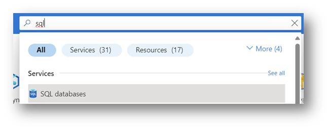
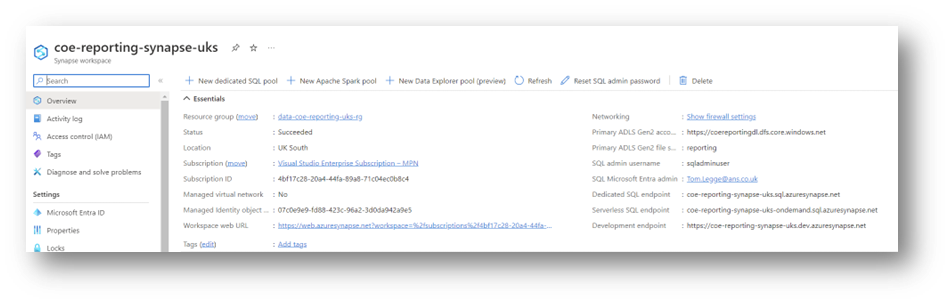

# ANS DCoE SDLH v2.X
[[_TOC_]]

# Authors
Tom Legge

# Overview
This document describes the procedures for accessing  SDLH v2.x.

# Access
The following steps are aimed at the ‘data engineer’ persona, and are pre-requisits to many of the procedures below.

## Metadata databases
### Grant access to the metdata databases

1. Admin users entra accounts can be mapped to the admin security group.
2. Other users can be granted access through SQL Logins, or Entra Users. ANS recommends users are authentication via Entra. Guidance is available from Microsoft.[[1]](#footnote-2)

### Connect to the metadata databases

1. In the Azure portal (portal.azure.com), search for ‘sql’ and then select ‘sql databases’ to view available SQL databases.

1. On the results page, optionally filter by subscriptions which were used to deploy the ‘Modern Data Platform’ (the names of the subscriptions are chosen by the customer).
2. Select the relevant metadata database. The name of each database is typically “{customer name}-data-sqldb-001”. Separate servers for dev, test, and prod will exist, with a typical name of “{customer name}-uks-data-{environment}-sql”.
3. Optionally set the firewall rules to allow you to connect by going to ‘Set server firewall’ in the ‘Overview’ page, and then adding your IP address. Some customers may not allow this method, but instead whitelist the IP address range of an office location or VPN – requiring users to be in an office or connected to the corporate VPN.
4. To connect using SQL Server Management Studio (SSMS) or Azure Data Studio (ADS), go to ‘Properties’ and copy the ‘Server name’ value.
5. In SSMS or ADS, create a new connection and use ‘Azure Active Directory’ / ‘Azure Entra ID’ as the authentication method.
6. Optionally specify the default database as “{customer name}-data-sqldb-001”.
7. Connect to the database.

## Synapse

### Connect to a Synapse serverless pool database

Serverless SQL pool can be access using SQL authentication or Entra ID authentication. ANS recommends using Entra ID for authentication, as this will simplify management (e.g. when a user leaves the organisation, they will also lose access to any resources accessed via Entra authentication).

The SQL Serverless pool database server name can be found on the ‘Overview’ page of the relevant Synapse workspace.

### Create an Entra User in a Synapse serverless pool database

1. Login to the Serverless SQL database you want to grant access to and create an Entra Login with the following script.

CREATE USER [{user email address}] FROM EXTERNAL PROVIDER;

GRANT SELECT ON SCHEMA:: [{schema name}] TO [emailaddress]

ALTER ROLE db\_datareader ADD MEMBER [{user email address}]

GRANT REFERENCES ON DATABASE SCOPED CREDENTIAL:: [cred\_managed\_identity] TO [{user email address}]

The final line is optional. However, if you don’t include it, then you will need to grant the same user the RBAC role ‘Storage Blob Data Contributor’ on the relevant storage account containers.

Hints:

* You may require Active Directory reader role to accomplish this step.
* You may wish to try running this script from within Synapse workspace, rather than by connecting through a client such as Azure Data Studio

### Create a SQL login in a Synapse serverless pool database

1. As a SQL Administrator, run the following script.

CREATE LOGIN [{login name}] WITH PASSWORD ='{enter secure password}'

CREATE USER [{login name}] FROM LOGIN [{login name}]

GRANT SELECT ON SCHEMA:: [{schema name}] TO [{login name}]

GRANT REFERENCES ON DATABASE SCOPED CREDENTIAL::[cred\_managed\_identity] TO [{login name}];

The final line is optional. However, if you don’t include it, then you will need to grant the same user the RBAC role ‘Storage Blob Data Contributor’ on the relevant storage account containers.

This basic script will grant ‘SELECT’ access to any schemas referenced. For a more comprehensive guide, please see the Microsoft documentation:

<https://learn.microsoft.com/en-us/azure/synapse-analytics/sql/sql-authentication?tabs=serverless>

## Storage Accounts

### Browse the storage accounts

To browse the storage accounts, you will need the RBAC role ‘Storage Account Data Reader’. To make changes to the files and folders within the storage accounts, you will need the RBAC role ‘Storage Account Data Contributor’.

## DevOps

### Access Azure DevOps

The SDLH will have an Azure DevOps project. A project admin or your DevOps organisation owner will need to add you to the project if you are required to commit code and make changes to the Synapse artefacts (such as triggers, pipelines etc.).
