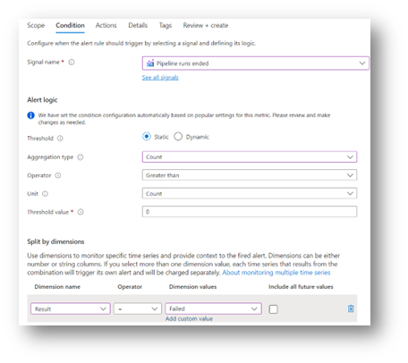
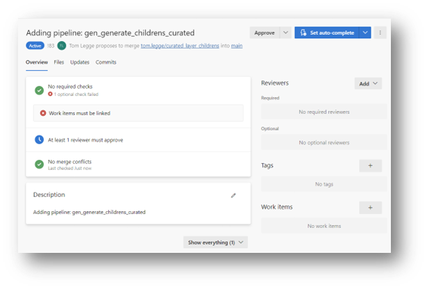
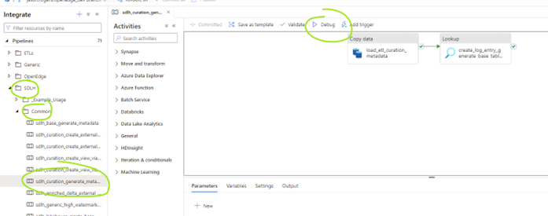

# ANS DCoE SDLH v2
[[_TOC_]]

# Authors
- Tom Legge
- Andrei Dumitru
- Darren Price
- Jason Rogers

# Overview
This document describes the procedures for using SDLH v2.x.

# Metadata

SDLH pipelines are metadata driven. The metadata is stored in an Azure SQL database. The Azure SQL database isn’t typically interacted with directly by the user, instead a Synapse pipeline is used to populate the SQL database with metadata, which is supplied via a CSV file. These procedures describe how to maintain your metadata in the correct way.

## Generating Metadata for a new source system

### Complete metadata form

The current version of the metadata form can be found in the DevOps repository called “sql”, in the folder called metadata > sdlh\_metadata\_form > metadata\_form.csv

| Fields | Allowable Values / format | Description |
| --- | --- | --- |
| SOURCE\_TYPE | Allowable Values:  SQL\_SERVER, AZURE\_SQL, AZURE\_SQL\_MI, MY\_SQL, POSTGRES\_SQL | Type of source data store |
| SOURCE\_SYSTEM | {source system name} | A descriptive name |
| SOURCE\_GROUPING\_ID | 1, 2, 3… 100 | Used to group tables together |
| IS\_ENABLED | 1, 0 | Used to control if a table is ingested or not |
| LOAD\_TYPE | Allowable values:  FULL\_LOAD, CHANGE\_TRACKING, WATERMARK, CDC | (CHANGE\_TRACKING is for SQL Server only) |
| BATCH\_FREQUENCY | Allowable Values:  Hour, Day |  |
| SOURCE\_CONNECTION\_STRING | {keyvault secret name} | Azure KeyVault secret name containing full connection string |
| DATABASE\_NAME | {database name} | Source system database name |
| SCHEMA\_NAME | {schema name} | Source system table schema name.  This should be left empty if source type is MY\_SQL |
| TABLE\_NAME | {table name} | Source system table name |
| PRIMARY\_KEYS | If single column then: {column name}  If more than 1 column then: “{column name}, {column name},..” | Name of table primary key or keys separated by commas. |
| COLUMNS\_TO\_EXCLUDE | If single column then: {column name}  If more than 1 column then: “{column name}, {column name},..” | List of columns to exlucde separated by commas. |
| WATERMARK\_COLUMN | {column name} | Name of column which captured last updated date or version number |
| SERVERLESS\_SQL\_POOL\_DATABASE | {target database name} | Destination Synapse serverless database name |
| SERVERLESS\_SQL\_POOL\_SCHEMA | {target schema name} | Destination Synapse serverless schema name |
| CUSTOM\_FIELD\_1 | n/a | Custom fields |
| CUSTOM\_FIELD\_2 | n/a | Custom fields |
| CUSTOM\_FIELD\_3 | n/a | Custom fields |
| CUSTOM\_FIELD\_4 | n/a | Custom fields |
| CUSTOM\_FIELD\_5 | n/a | Custom fields |
| CUSTOM\_FIELD\_6 | n/a | Custom fields |
| CUSTOM\_FIELD\_7 | n/a | Custom fields |
| CUSTOM\_FIELD\_8 | n/a | Custom fields |

### Deploy the metadata form across environments

1. Navigate to your DevOps project (www.devops.com/{organisation name}/{project name}).
2. Navigate to ‘Repos’ in left hand menu, and then from the repo dropdown, choose ‘sql’.
3. Create a new DevOps branch in the sql repo, by clicking on ‘main’ in the drop-down and selecting ‘New branch’.
4. Navigate to the folder metadata > sdlh\_metadata\_form.

5. Upload a new version of the file metadata\_form.csv, overwriting the existing version.

6. Click on ‘Create a pull request’.

7. Click on ‘Create’.
8. Click on ‘Approve’ (or if your branch policies do not allow you to approve your own pull requests, then ask a reviewer to review and then approve’.
9. Once approved, click on ‘Complete’ and then ‘complete merge’ once the modal window appears.
10. Navigate to ‘Pipelines’ and check that the pipeline named ‘metadata\_files\_deployment’ has started. If not, you can manually run it.
11. Click on the pipeline name to see more information.

12. The pipeline will automatically deploy the updated metadata\_form.csv file to the dev storage account.
13. Optionally, you can deploy the file to the test and prod storage accounts, but this will require approval. To approve deployment, click on the ‘deploy\_test’ box in the ‘stages’ window, and then click ‘Review’ and then click ‘Approve’.

14. Once deployment to test is complete, repeat the steps for deployment to prod.

### Generate metadata for use by Synapse pipelines

1. Once deployment of the metadata\_form.csv is completed in relevant environments (by the preceding step), navigate to the relevant Synapse workspace (e.g. dev, test or prod).
2. Within Synapse, go to ‘Pipelines > Common’ and then select the pipeline “sdlh\_base\_generate\_metadata”.
3. Click ‘debug’ to run the pipeline.
4. Wait for the pipeline to complete. This pipeline will update the table ETL.BaseMetadata.

5. Verify that the table ETL.BaseMetadata has been updated, by connecting to the SQL database used to store the metadata.
6. The final step, is to run the source specific ‘generate\_metadata pipeline. For example, if the source is ‘**SQL\_Server**’, navigate to ‘SDLH > SQL\_Server’ folder and then select the relevant generate\_metadata pipeline – in this example it is ‘sdlh\_sql\_generate\_metadata’.
7. Click ‘Debug’ and in the modal window, ensure your Parameters are correct.
   1. PARAM\_SOURCE\_TYPE = SQL\_SERVER (default value – do not change).
   2. PARAM\_SOURCE\_SYSTEM = the name in the column ETL.BaseMetadata.SOURCE\_SYSTEM that you want to generate / update metadata for (for example, if you have just updated the metadata\_form.csv with a new source system, this is the name you will use when executing the pipeline.
   3. PARAM\_SOURCE\_GROUPING\_ID\_START = 1 (default value – only update if you want to generate / update metadata for a specific group).
   4. PARAM\_SOURCE\_GROUPING\_ID\_END = 100 (default value – only update if you want to generate / update metadata for a specific group).
8. Wait for the pipeline to finish.
9. Verify the metadata database has been successfully updated by checking the tables ETL.JsonMetadata, ETL.SQLTableMetadata, ETL.SQLColumnMetadata.

## Updating existing metadata

In this scenario, you may need to update existing metadata, for example, to remove tables that have previously been ingested, exclude or remove columns from existing tables, add new columns, update other metadata about existing columns (e.g. if the max character length changes in the source system).

### General approach

Regardless of the nature of the change, the general approach to updating existing metadata is to:

1. Modify the metadata\_forms.csv file in the DevOps repository and then follow the steps in 4.1 to promote that form into the dev, test, and prod storage accounts.
2. Run the update metadata Synapse pipelines.
3. Drop any external tables with metadata changes
4. Delete any underlying files from tables with metadata changes
5. Run an ETL ingestion pipeline (which will recreate the tables with updated schema).

Not all steps above are required, depending on the type of change, which are covered below.

### Remove existing tables already ingested

1. Update the metadata\_form.csv as part of ‎4.1 – for tables you wish to remove, change the value in the column ‘IS\_ENABLED’ to 0 and then re-run the subsequent steps to update the metadata database across relevant environments. This is the preferred method, rather than deleting the row from the metadata\_form.csv file.
2. Manually drop any newly exlcuded tables from the serverless layer using the SQL command, whilst connected to the relevant serverless sql database(s):

DROP EXTERNAL TABLE [{schema name}].[{table name}]

3. Manually delete the underlying files from the storage account(s). You should do this in two places:
   1. the raw container (where files are landed) and;
   2. the enriched container, where records are merged into the delta tables.

### Exclude columns already ingested

This assumes the columns still exist in the source system, but you no longer want to ingest them as part of your ETL into Synapse:

1. Update the metadata\_form.csv in the DevOps repository using the column “COLUMNS\_TO\_EXLCUDE”, following the synatax described in ‎4.1.1.
2. Follow the usual procedures for promoting the metadata\_form and running the update metadata pipelines in 4.1
3. Manually drop any tables with newly exlcuded columns from the serverless layer using the SQL command, whilst connected to the relevant serverless sql database(s):

DROP EXTERNAL TABLE [{schema name}].[{table name}]

4. Manually delete the underlying files from the storage account(s). You should do this in two places:
   1. the raw container (where files are landed) and;
   2. the enriched container, where records are merged into the delta tables.
5. Run the relevant Synapse ingestion pipeline. As the table has been dropped, it will be recreated with the updated schema (i.e. without the exlucded columns).

### Add new columns / remove columns that no longer exist in the source system / manage schema changes to existing columns

The metadata\_form.csv does **not need** to be modified (assuming IS\_ENABLED = 1 and the columns are not in the COLUMNS\_TO\_EXCLUDE list)

1. Re-run the source specific ‘generate\_metadata’ pipeline. For example, if the source is ‘**SQL\_Server**’, navigate to ‘SDLH > SQL\_Server’ folder and then select the relevant generate\_metadata pipeline, which would be ‘sdlh\_sql\_generate\_metadata’.
2. This pipeline will compare schemas in the source system to schemas in the metadata database and if it detects a difference, will update the metadata database and increment the schema version number.
3. Check the metadata database for any schema changes by running this command

SELECT \* FROM ETL.SQLTableMetadata

WHERE SCHEMA\_VERSION = (SELECT MAX(SCHEMA\_VERSION) FROM ETL.SQLTableMetadata)

1. Manually drop any tables with updated schemas from the serverless layer using the SQL command, whilst connected to the relevant serverless sql database(s):

DROP EXTERNAL TABLE [{schema name}].[{table name}]

1. Manually delete the underlying files from the storage account(s). You should do this in two places:
   1. the raw container (where files are landed) and;
   2. the enriched container, where records are merged into the delta tables.
2. Run the relevant Synapse ingestion pipeline. As the table has been dropped, it will be recreated with the updated schema (i.e. without the exlucded columns).

## Metadata for the curated layer

### Create and Update curated layer metadata

The curated layer, is a container within the storage account(s) used to stored tables which are generated as part of an ETL in Synapse. Typically, curated layer tables are the result of joining two or more tables together from the enriched layer, and are the tables consumed by downstream users and services, such as PowerBI.

The creation of these tables can be controlled by metadata in a similar manner to how we ingest copies of source system tables – through the use of a csv form.

1. In the Azure DevOps organization, download the “curation\_metadata\_form.csv”.
2. Click on the “Repos” tab on the left side and select “sql” at the top:

3. Navigate to the “metadata/sdlh\_curation\_metadata\_form” folder. Inside, download the “curation\_metadata\_form.csv”:

4. Add the input metadata entries for each table that needs to be created:

THIS SECTION TO BE COMPLETED

## KeyVault Secrets

### Postgres and MySQL

Secrets used for Postgres and MySQL ETL pipelines should be formatted as follows:

| Secret | Format |
| --- | --- |
| 1 | Server=[server name];Port=[port number];Datebase=[database name];UID=[user name] |
| 2 | [password] |

For secret 1, use the exact ordering above.

The metadata form column ‘SOURCE\_CONNECT\_STRING’ should be formatted as followed:

“[secret name 1],[secret name 2]”.

\* note – no space between secret names and enclose ‘cell’ inside double quotes.

# Synapse Pipelines

Synapse pipelines are responsible for generating metadata and for ETLs from source systems into the data lake, as well as creating external tables in the sql serverless layer that sits on top of the data lake files.

## ETL Pipelines

### Create a control pipeline

A control pipeline is used to ingest tables from a source system, once that source system data has been defined in the metadata database. Control pipelines invoke existing pipelines and pass parameters into those pipelines. Synapse triggers are created to automatically trigger the control pipeline, but they can also be manually triggered for testing and for ad-hoc ETLs.

1. Navigate to the dev Synapse workspace.
2. Create a new branch (see ‎6.DevOps section for more specific instructions on branching in Synapse).
3. In the Synapse workspace menu (left hand side) select ‘Integrate’
4. Create a new folder with a name that refers to the source system being ingested e.g. “ETL\_{source\_system\_name}”.
5. To this folder, add a new control pipeline. To understand the activities required inside this pipeline, see the example pipeline “SDLH > \_Example\_Usage > spe\_adventureworks\_grouping\_1”. This pipeline can be cloned and the ‘copy’ moved to the new folder created in step 4.
6. Rename your new control pipeline. A typical name is “spe\_source\_name\_grouping\_number”.

Figure 1 typical activities in a control pipeline. Additional activities not shown include an activity to invoke a pipeline to write data to the curated layer. The activities are all ‘Exectute’ pipeline activites, which invoke existing Synapse pipelines.

7. Configure your control pipeline parameters.

Figure 2 The typical parameter Names and Types for a Synapse control pipeline

The PARAM\_SOURCE\_SYSTEM value should match the value in the metadata database in the table ETL.BaseMetadata and the column SOURCE\_SYSTEM. The PARAM\_SOURCE\_GROUPING\_ID should match the value in ETL.BaseMetadata and the column SOURCE\_GROUPING\_ID for the tables you want the pipeline to ingest.

You may wish to organisation your control pipelines, by having them inside a root folder for ETLs and then subfolders for each source system. This folder structure should sit outside of the pre-existing folders “Generic” and “SDLH” e.g.

Figure 3 Example folder structure for control pipelines and SDLH built-in pipelines

8. Commit any changes to your new control pipeline.
9. Trigger your pipeline to ensure it works. You can trigger it in debug mode.
10. Associate your pipeline with a Synapse trigger (either an existing trigger or a new trigger).
11. When you are happy with the pipeline, then merge your dev branch into main by completing a pull request (see ‎6.DevOps section for more specific instructions on how to merge a branch and then promote the changes into Test and Prod environments).

## Pipeline triggers

### Create a new trigger

1. Create a new branch in Synapse Dev.
2. In the control pipeline you want to trigger, select Trigger > New/Edit.
3. In the dropdown menu, ‘Choose trigger’, select ‘+ New’.
4. Complete the settings for your trigger and optionally, turn it on.
5. Create a Pull Request in Dev and merge your changes into the main branch following the Synapse DevOps procedure detailed in the section: ‎"7.1.1. Creating Synapse Dev branch and merging back into main”.
6. Publish your changes to TEST and PROD following the procedure in section “‎7.1.2.Promoting into test and prod Synapse environments”
7. Ensure your triggers are turned on/off in the relevant environments – this can be controlled via the DevOps build and release pipeline. If you only want to turn triggers on/off in Test and Prod, you can manually do this directly in those environments.

### Update an existing trigger

Updates include: turning a trigger on or off, updating the frequency and time.

1. In Dev Synapse, pause the trigger you intend to modify.
2. Create a new branch in Synapse Dev.
3. Inside the new branch, edit your trigger(s).
4. Commit your changes.
5. Create a pull request and complete the normal steps to merge your changes into the main branch.
6. Publish your main branch in Dev into TEST And PROD by clicking on ‘publish’ within the dev environment.
7. Ensure the DevOps pipeline ‘synapse\_publish’ runs to completion (by approving the deployment to test and prod).
8. Ensure your triggers are turned on/off in the relevant environments.

### Trigger a pipeline manually

As part of testing and debugging or ad-hoc data loading outside of the scheduled triggers, you may wish to manually trigger a pipeline.

There are two methods to do this – run a pipeline by pressing ‘Debug’ or click ‘Trigger > Trigger now’.

## Monitor Synapse Pipelines

### Create email alerts to monitor pipeline failures

Azure Alerts can be used to send emails based on a condition. A typical use-case is to alert users by email when a pipeline run fails.

This is how to set-up an alert:

1. Go to ‘Alerts’ > ‘alerts’ > ‘Create’ > ‘Alert Rule’.

2. Within ‘Scope’ select the relevant Synapse workspace.

3. Use the following conditions

4. Create an action group in the relevant subscription and resource group, if one doesn’t already exist

5. In the action group, add each person who should receive the alerts and then click ‘save.

# Synapse Serverless Pool

The Synapse Serverless SQL pool is a query service over the data in your data lake. Some key operations are described below.

## Serverless Database operations

### Drop a database

1. Check for any processes running on the database you want to drop by running the following command from the master database:

select DB\_NAME(database\_id), 'kill '+cast(session\_id as varchar(10)), \*

from sys.dm\_exec\_sessions

where DB\_NAME(database\_id) NOT IN ('master')

-- Optionally specify the name of the database you want to drop --

-- AND DB\_NAME(database\_id) = 'synw\_data\_uks\_dnadev\_lakehouse'

order by 1

2. Then kill any processes linked to that database by running the following command for each process id:

Kill <process id>

3. Finally, run the following command from the master database (not the database you want to drop)

DROP DATABASE [<database name>]

### Create a new Synapse serverless pool database and associated external locations and file types

#### Option 1 – automatically

1. Within Synapse, open the pipeline ‘SDLH > Common > sdlh\_lakehouse\_create\_basic\_config

Configure the parameters:

We recommend using the default collation (Latin1\_General\_100\_CI\_AS\_SC\_UTF8). A non UTF8 collation isn’t recommended when the lakehouse needs to read from csv files.

For customers who want a medallion architecture, the container names can be renamed. We recommend the following mapping:

| Paramater Name |  |
| --- | --- |
| PARAM\_CONTAINER\_NAME\_RAW | raw |
| PARAM\_CONTAINER\_NAME\_ENRICHED | bronze |
| PARAM\_CONTAINER\_NAME\_CURATED | silver |

2. Gold can be created separately as part of a curation pipeline.
3. Run the pipeline in debug mode.
4. Repeat for any many databases as you need. For example, you could create a ‘bronze’, ‘silver’ and ‘gold’ database.

#### Option 2 - manually

1. When connected to the Synapse serverless ‘server’ run the following command:

CREATE DATABASE [{database name}]

2. You will need to link this database to underlying storage, by creating an external location:

-- create master key that will protect the credentials:
CREATE MASTER KEY ENCRYPTION BY PASSWORD = <enter very strong password here>

-- create credentials for data lake storage account containers
CREATE DATABASE SCOPED CREDENTIAL cred\_managed\_identity WITH IDENTITY='MANAGED IDENTITY'

GO

CREATE EXTERNAL DATA SOURCE {name} WITH (

LOCATION = 'https://{storage account name}.blob.core.windows.net',

CREDENTIAL = cred\_managed\_identity

);

3. Repeat across other environments if required

### Create a new schema in a Synapse serverless pool database

1. When connected to the relevant database (i.e. not master) run the following command:

CREATE SCHEMA [{schema name}]

2. Repeat across other environments if required

# DevOps

## General Settings

### Update Service Connections

DevOps is able to communicate with Azure through service connections. Depending on how these were initially configured, they may expire and require refreshing to ensure the continued functioning of the DevOps deployment pipelines.

1. Navigate to ‘https://dev.azure.com/{devops org name}/datawarehouse-data/\_settings/adminservices’.
2. Click on any of the service principals which have the blue dots, showing an issue. E.g.

3. Click on 'Manage Service Principal' – this will take you into the Azure Portal.

4. Once you are in the settings page for the Service Principal, click on 'Certificates & secrets' on the left hand menu, and then ' + New client secret'

5. Navigate back to the service connections page in DevOps and then navigate into the service connection. Then click ‘Edit’

6. Then click ‘Save’.
7. Repeat the same steps for the remaining Service Principals.

## Synapse workspace development and promotion

This section covers the general steps when making changes to any artefacts within Synapse (e.g. a pipeline, a linked service, a dataset, a pipeline trigger). It covers how to create a branch in the dev synapse, commit changes, merge your branch back into main, publish it to dev live and then promote your dev branch into the test and prod synapse environments. There are two parts to it: 1) creating a branch in dev, working on it and merging that back into dev main. 2) pulling that change into dev live and then promoting it to the other environments.

### Create a Synapse Dev branch and merge back into main

1. In the ‘dev’ environment, select the git drop-down and then select ‘New branch’.

2. Name your branch as follows: [firstname].[surname]/[short description of your feature] e.g. Tom.legge/updates\_to\_trigger\_schedule.
3. Work on your changes inside Synapse, being sure to press ‘commit’ or ‘commit all’.
4. When you are ready to merge the branch back into ‘main’ select ‘Create pull request’ from the drop-down. This will automatically open a new browser tab or window, taking you to a ‘New pull request’ page within your DevOps project.
5. Complete any required details in the form, such as a reviewer name or a title if it is blank.

6. Click ‘Create’
7. If you require another person to review, then will need to wait for them to approve. If you can approve yourself, then click “Approve”.

8. Once all reviewers have approved the merge, then click “Complete”.
9. A modal window will appear with additional options. The defaults are fine and shouldn’t be changed unless you understand the reasons. (for example, best practice is to delete branches after merging). Click “Complete merge”.
10. Once the merge is complete, navigate back to Synapse and refresh the browser window. This will force you to select which branch to view, as your current branch will have been deleted. Select “main”, unless you wish to create a new branch. At this point, you can stop until you are ready to promote into Test and Prod. However, if you are reliant on triggers in Dev, then you will need to press ‘publish’.

### Promote into test and prod Synapse environments

1. Click ‘Publish’ in Synapse dev. This will update the code Synapse Dev is using and update the publish branch in DevOps, which will trigger a DevOps build and release pipeline (<https://learn.microsoft.com/en-us/azure/data-factory/continuous-integration-delivery-improvements>) which will promote the latest publish branch into test and prod.
2. When publishing has finished, navigate to DevOps and in the Pipelines section, you will see the pipeline “synapse\_workspace\_deployment” has been triggered, with the pipelines default settings. You may wish to cancel this pipeline if you want to re-run with different options selected. If you cancel and re-run, then configure the pipeline run from the options below:

a. Do you want to promote to TEST only or TEST and PROD. If you only want to deploy to TEST, unselect ‘deploy\_prod\_enabled’.
b. Do you want your Synapse Pipeline Triggers to be ‘on’ or ‘off’ in TEST and PROD (you can also turn on specific pipeline triggers and leave others ‘off’).
   1. To turn off all triggers in TEST and/or PROD, de-select ‘test\_toggle\_triggers’ and/or ‘prod\_toggle\_triggers’
   2. To turn on all triggers, push a ‘\*’ in the relevant box and ensure ‘x\_toggle\_triggers’ is selected for the environment you want triggers to be on in.
   3. To turn on select triggers, replace the \* with the name of the triggers separated by commas.
c. Finally, click ‘run’.
d. You will have to ‘approve’ the deployment to test.
e. If you are also deploying to prod, wait until test deployment is complete and then approve deployment to ‘prod’.
3. Once you have selected options, then click ‘run’.
4. If you are deploying to test, then you or an approver will need to approve. Click ‘Review’ and then ‘Approve’

5. Wait until the deployment has finished. If you are also deploying to Prod, then repeat the approval steps for deployment to prod.

## Development of the metadata database

The metadata databases are source controlled and changes can be promoted to the test and prod dbs. Therefore, **never** make direct changes to the TEST and PROD metadata database. Always follow this process.

### Branching and Promotion

#### Method 1 (using the DevOps Web UI)

This method works well for simple changes because it skips the step of cloning the repo to your local machine. However, it is not suitable for complex changes.

1. Make changes manually in the dev metadata database, ensuring your changes can be recreated as files e.g., if you need to create a new table, create a sql file with the name of your new table and include the ‘CREATE TABLE’ script inside the file. Save it locally as well as running it directly inside the dev metadata database.

Figure 4 Example file, that is both run on the dev metadata database directly, and used to update the DevOps repo.

2. Go to the repository named ‘sql’ in DevOps
3. Create a new branch
4. Navigate to the new branch and make changes directly to the existing file(s) or upload new files. The Metadata Database Project is within database\_projects > azure\_sql\_db.

Figure 5 Example of files used to create tables in the metadata database

5. Update the project file ‘azure\_sql\_db.sqlproj’ to reflect any changes, such as new tables

Figure 6 sql project file listing folders and files to include in the project

6. Create a ‘pull request’ to merge the branch back into main branch. As part of the merge process, a build pipeline will start, as a check to see if the project has any errors.
7. Wait for the ‘build’ stage to finish. This build is used to check for potential errors in the DACPAC.

Figure 7 Monitoring the initial test build of the sql dacpac

8. Assuming you have no major errors, you can complete the approval of the Pull Request by clicking on ‘Approve’ and then click ‘Complete.’

Figure 8 Approval of the pull request following successful test build

9. On completion, the same DevOps pipeline will trigger again, this time will try to complete all steps, not just the build step. Go to Pipelines > azure\_sql\_build\_and\_deployment and wait for the ‘build’ to finish (again).
10. Approve the deployment to test.

Figure 9 Approving the deployment to test

11. Once the deployment to test is complete, approve the deployment to prod.

Your test and prod metadata database should now reflect your dev metadata database, in terms of tables, stored procedures and functions.

# Reference Data

You may wish to ‘upload’ relatively static datasets which cannot be directly copied from a source system (e.g. a csv file containing reference data) and make the data available as an external table.

# Curation

## Overview

Whilst ‘Enrichment’ denotes the importing of source data (either full or partial loads), ‘Curation’ denotes the business-logic transformations applied to the source data to make it business/presentation-ready.

Enrichment = importing raw (E.g. APIs, database connectors, flat file imports)

Curation = transformations (E.g. stored procedures)

Note that in Serverless SQL, tables can only be External Tables and are created via CETAS (“create external table as”) statements, which are the main type of transformation you will use to develop your business logic.

## Process Steps

### Writing the Transformations

The initial step is development: writing your transformations.

**Stored Procedures**

In either SSMS or Azure Data Studio, write your procedure with the following simplified template:

CREATE PROCEDURE [<Schema>].[<ProcedureName>] AS
BEGIN
IF EXISTS (SELECT \* FROM sys.external\_tables WHERE object\_id = OBJECT\_ID(N'[<Schema>].[<TableName>]') AND type IN (N'U'))
BEGIN
DROP EXTERNAL TABLE [<Schema>].[<TableName>];
END
CREATE EXTERNAL TABLE [<Schema>].[<TableName>]
WITH (
LOCATION = '<ADLS>/<Location>/<Path>',
,DATA\_SOURCE = [ExternalDataSource],
,FILE\_FORMAT = [FileFormat]

) AS
-- your SQL ↓
SELECT ... FROM ...
END
GO

**Notebooks**

First create a new branch if you’re not already working in one:

In Synapse click Develop, go to Notebooks, click the ellipsis, click New Notebook and write your transformation logic in the cells (remember to give the Notebook a descriptive name).

### Testing the Transformations

After developing your transformation it’s a good idea to test it.

To run a transformation many times that creates external tables, you’ll need to ensure that the underlying files have been deleted before running:

### Deploying the Transformations

Once tested, your transformation can be deployed so that it’s available to run in Synapse via a Pipeline.

**Stored Procedures**

Go to DevOps --> **sql** repo and create a new branch (typically from the **main** branch):

Go to **database\_projects** --> **synapse\_sql\_serverless** --> **Stored Procedures**; if a file for your procedures doesn’t exist then create one, otherwise click Edit; add your procedure definition (as CREATE OR ALTER) to the file:

Go to **metadata** --> **sdlh\_curation\_metadata\_form** and click Edit:

Update the form to record your new procedure:

| Fields | Allowable Values / format | Example |
| --- | --- | --- |
| CURATION\_GROUPING\_ID | 1, 2, 3, ... | 1 |
| CURATION\_GROUPING\_PRIORITY | 1, 2, 3, ... | 1 |
| IS\_ENABLED | 0 / 1 | 1 |
| TARGET\_DATABASE\_NAME | <DatabaseName> | silver\_db |
| TARGET\_SCHEMA\_NAME | <SchemaName> | sales |
| TABLE\_NAME | <TableName> | targets |
| EXTERNAL\_DATA\_SOURCE | <DataSourceName> | exds\_gen2\_silver |
| EXTERNAL\_FILE\_FORMAT | <FileFormatName> | exff\_parquet |
| ADLS\_CONTAINER | <ContainerName> | silver\_container |
| ADLS\_LOCATION\_PATH | <LocationPath> | files/staging/sales/ targets |
| SQL\_QUERY\_OR\_PROCEDURE\_NAME | <SQL / ProcedureName> |  |
| CUSTOM\_FIELD\_x | Any value | 1000 (in this case we use the field as a procedure argument) |
|  |  |  |

Commit the changes and complete the pull request; you can view the new metadata file being deployed by going to Pipelines and viewing the ‘serverless’ pipeline running.

Finally, go to Synapse and run the **SDLH** --> **Common** --> **sdlh\_curation\_generate\_metadata** pipeline. This will update the **ETL.CurationMetadata** table to record the changes you just made to **curation\_metatada\_form**.

**Notebooks**

Since the transformation is being done as a Notebook which already lives in Synapse there is no deployment to do here.

### Creating/Updating the Pipeline

You can chain together as many activities as you wish, depending on the complexity of your business logic:

**Stored Procedures**

Now you can add your transformation to a Pipeline so that it can be run.

In Synapse go to Integrate, right-click Pipelines and click New Pipeline:

Go to Activities --> General and drag across the Execute Pipeline activity.

Give the activity a suitable name; under Settings, from the dropdown menu choose **sdlh\_curation\_create\_external\_table\_via\_stored\_proc** (this pipeline is an SDLH component that will execute the procedures that you just recorded in **curation\_metatada\_form** under a specific grouping & priority).

Finally, add the values for the grouping and priority parameters to reflect the set of procedures that you would like to be executed in this level of your curation.

**Notebooks**

Go to Activities --> General and drag across the Notebook activity.

Give the activity a suitable name; under Settings, from the dropdown menu choose your notebook and whichever Spark pool to use for this activity.

### Running the Pipeline

Finally, you can run your transformation.

Go to your new Pipeline and click Debug:

### Deploying the Pipeline

In Synapse, go to the Branch section and click Create Pull Request; in DevOps approve & complete the pull request; in Synapse click Publish (which will now be available) and wait for the deployment to complete.

# Known Limitations

**Change Tracking**: a single instance of a pipeline run cannot handle change tracking incremental loads from multiple databases. Therefore, when change tracking incremental loads are used, you must ensure that your Synapse Pipeline trigger will only ingest from a single database.

1. <https://learn.microsoft.com/en-us/azure/azure-sql/database/secure-database-tutorial?view=azuresql> [↑](#footnote-ref-2)
